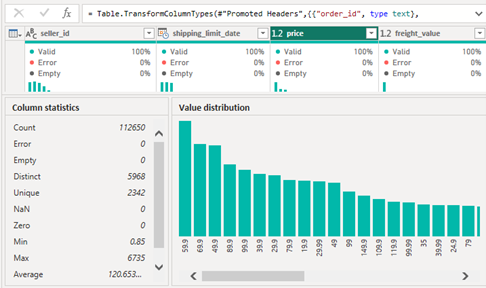

**تحلیل عملکرد فروش، لجستیک و رضایت مشتری در پلتفرم  Olist**


**۱. تعریف مسئله بیزینسی**
Situation —   وضعیت موجود
Olist  یک پلتفرم مارکت‌پلیس برزیلی است که فروشندگان کوچک و متوسط را به مشتریان سراسر کشور متصل می‌کند. این پلتفرم بین سال‌های ۲۰۱۶ تا ۲۰۱۸ بیش از ۱۰۰ هزار سفارش را پردازش کرده است.
Complication چالش
مدیریت ارشد داده‌های خام را در قالب فایل‌های پراکنده (سفارش، پرداخت، نظرات، لجستیک) در اختیار دارد، اما دید یکپارچه‌ای از عملکرد فروش، کیفیت تحویل و رضایت مشتری ندارد. تصمیم‌گیری‌ها بدون داشبورد و بر پایه حدس انجام می‌شود.
Business Question  سوال اصلی
کدام عوامل (جغرافیا، زمان تحویل، دسته محصول، روش پرداخت) بیشترین تاثیر را روی رضایت مشتری و درآمد دارند، و چه اقداماتی می‌تواند نرخ رضایت و بازگشت مشتری را افزایش دهد؟
طراحی داشبورد:

**برای مدیر عامل:**
دغدغه اصلی: روند کلی درآمد و رشد
نیاز داشبورد: KPIهای کلان، مقایسه دوره‌ای، خلاصه اجرایی
**برای مدیر لجستیک: **
	دغدغه اصلی: تاخیر تحویل، عملکرد فروشندگان
	نیاز از داشبورد: نقشه جغرافیایی، زمان تحویل، گلوگاه‌ها

**برای CRM:**
	دغدغه اصلی: رفتار و وفاداری مشتری
	داشبورد: تحلیل RFM، Cohort، نرخ بازگشت مشتری

**مدیر محصول: **
	دغدغه اصلی: عملکرد دسته‌بندی‌ها
	داشبورد: فروش و سود به تفکیک دسته محصول

**KPI Dictionary:**

	Total Revenue: مجموع درآمد از آیتم‌های فروخته‌شده
		فرمول:	SUM(price + freight_value)	
هدف: اندازه‌گیری رشد کلی

AOV: میانگین ارزش هر سفارش
	فرمول:  Total Revenue ÷ Total Orders
هدف: سنجش رفتار خرید
	
	Delivery Delay: تاخیر نسبت به تخمین
		فرمول: تاریخ تحویل واقعی – تخمینی
هدف: سنجش کیفیت لجستیک

Review Score Avg: میانگین امتیاز نظرات
	فرمول: AVG(review_score)
هدف: سنجش رضایت مشتری
	
	Repeat Purchase Rate: درصد مشتریان با بیش از یک خرید
		فرمول: مشتریان تکراری ÷ کل مشتریان
هدف: سنجش وفاداری

RFM Segment: سگمنت مشتری بر اساس
فرمول: Recency/Frequency/Monetary	
هدف: هدف‌گذاری بازاریابی

**Solution Architecture:**

● فایل‌های CSV خام Olist (۹ جدول مرتبط)

● پاکسازی و یکپارچه‌سازی داده در PostgreSQL یا Python/Pandas

●  ETL نهایی و تبدیل در Power Query

● مدل‌سازی داده به شکل Star Schema در Power BI

● ساخت لایه محاسباتی با DAX متریک‌های پایه و پیشرفته

● طراحی داشبورد تعاملی چندصفحه‌ای

● انتشار روی Power BI Service

# Data Profiling Report

## Table: `orders`

| Column Name | Data Type | Null % | Cardinality | Sample Value |
|-------------|-----------|-------:|-------------|--------------|
| `order_id` | Text | 0% | 99,441 (Unique) | `e481f51cbdc54678b7cc49136f2d6af` |
| `customer_id` | Text | 0% | 99,441 (Unique) | `9ef432eb6251297304e76186b10a928` |
| `order_status` | Text | 0% | 8 Values | `delivered`, `shipped`, `canceled`, ... |
| `order_purchase_timestamp` | DateTime | 0% | — | `2017-10-02 10:56:33` |
| `order_approved_at` | DateTime | 1% | — | `2017-10-02 11:07:15` |
| `order_delivered_carrier_date` | DateTime | 2% | — | `2017-10-04 19:55:00` |
| `order_delivered_customer_date` | DateTime | 3% | — | `2017-10-10 21:25:13` |
| `order_estimated_delivery_date` | DateTime | 0% | — | `2017-10-18 00:00:00` |

# 📦 Table: `order_items`

| Column Name | Data Type | Null % | Cardinality | Sample Value |
|-------------|-----------|-------:|-------------|--------------|
| `order_id` | Text | 0% | 98,666 | `e481f51cbdc54678b7cc49136f2d6af` |
| `order_item_id` | Integer | 0% | 1–21 | `1` |
| `product_id` | Text | 0% | 32,951 | `4244733e06e7ecb4970a6e2683c13e61` |
| `seller_id` | Text | 0% | 3,095 | `48436dade18ac8b2bce089ec2a041202` |
| `shipping_limit_date` | DateTime | 0% | - | `2017-10-06 11:07:15` |
| `price` | Decimal | 0% | 0.85–6,735 | `58.90` |
| `freight_value` | Decimal | 0% | 0–409.68 | `13.29` |

---

# 👥 Table: `customers`

| Column Name | Data Type | Null % | Cardinality | Sample Value |
|-------------|-----------|-------:|-------------|--------------|
| `customer_id` | Text | 0% | 99,441 (Unique) | `861eff4711a542e4b93843c6dd7febb` |
| `customer_unique_id` | Text | 0% | 96,096 | `8d50f5eadf50201ccdcedfb9e2ac8455` |
| `customer_zip_code_prefix` | Integer | 0% | 14,994 | `14409` |
| `customer_city` | Text | 0% | 4,119 | `Franca` |
| `customer_state` | Text | 0% | 27 | `SP` |

---

# 💳 Table: `order_payments`

| Column Name | Data Type | Null % | Cardinality | Sample Value |
|-------------|-----------|-------:|-------------|--------------|
| `order_id` | Text | 0% | 99,440 | `e481f51cbdc54678b7cc49136f2d6af` |
| `payment_sequential` | Integer | 0% | 1–29 | `1` |
| `payment_type` | Text | 0% | 5 Values | `credit_card`, `boleto`, `voucher`, ... |
| `payment_installments` | Integer | 0% | 0–24 | `2` |
| `payment_value` | Decimal | 0% | 0–13,664 | `99.33` |

# ⭐ Table: `order_reviews`

| Column Name | Data Type | Null % | Cardinality | Sample Value |
|-------------|-----------|-------:|-------------|--------------|
| `review_id` | Text | 0% | ~98,410 | `7bc2406110b926393aa56f80a40eba40` |
| `order_id` | Text | 0% | 98,673 | `e481f51cbdc54678b7cc49136f2d6af` |
| `review_score` | Integer | 0% | 1–5 | `5` |
| `review_comment_title` | Text | ~88% | - | `"Recomendo"` |
| `review_comment_message` | Text | ~59% | - | `"Muito bom o produto."` |
| `review_creation_date` | DateTime | 0% | - | `2018-01-18 00:00:00` |
| `review_answer_timestamp` | DateTime | 0% | - | `2018-01-18 21:46:59` |

---

# 📦 Table: `products`

| Column Name | Data Type | Null % | Cardinality | Sample Value |
|-------------|-----------|-------:|-------------|--------------|
| `product_id` | Text | 0% | 32,951 (Unique) | `1e9e8ef04dbcff4541ed26657ea517e5` |
| `product_category_name` | Text | ~1.85% | 73 | `cool_stuff` |
| `product_name_lenght` | Numeric | ~1.85% | - | `40` |
| `product_description_lenght` | Numeric | ~1.85% | - | `287` |
| `product_photos_qty` | Numeric | ~1.85% | 1–20 | `1` |
| `product_weight_g` | Numeric | ~0.01% | - | `225` |
| `product_length_cm` | Numeric | ~0.01% | - | `16` |
| `product_height_cm` | Numeric | ~0.01% | - | `10` |
| `product_width_cm` | Numeric | ~0.01% | - | `14` |

> **Note:** The original dataset uses the column names `product_name_lenght` and `product_description_lenght` (with the misspelling **lenght**). They are kept unchanged for consistency with the source data.

---

# 🏪 Table: `sellers`

| Column Name | Data Type | Null % | Cardinality | Sample Value |
|-------------|-----------|-------:|-------------|--------------|
| `seller_id` | Text | 0% | 3,095 (Unique) | `3442f8959a84dea7ee197c632cb2df15` |
| `seller_zip_code_prefix` | Integer | 0% | 2,246 | `13023` |
| `seller_city` | Text | 0% | 611 | `Campinas` |
| `seller_state` | Text | 0% | 23 | `SP` |

# 🌍 Table: `geolocation`

| Column Name | Data Type | Null % | Cardinality | Sample Value |
|-------------|-----------|-------:|-------------|--------------|
| `geolocation_zip_code_prefix` | Integer | 0% | 19,015 | `1037` |
| `geolocation_lat` | Decimal | 0% | - | `-23.545621` |
| `geolocation_lng` | Decimal | 0% | - | `-46.639292` |
| `geolocation_city` | Text | 0% | 8,011 | `sao paulo` |
| `geolocation_state` | Text | 0% | 27 | `SP` |

---

# 🔄 Table: `category_name_translation`

| Column Name | Data Type | Null % | Cardinality | Sample Value |
|-------------|-----------|-------:|-------------|--------------|
| `product_category_name` | Text | 0% | 71 (Unique) | `beleza_saude` |
| `product_category_name_english` | Text | 0% | 71 (Unique) | `health_beauty` |

---

# 📊 خلاصه کیفیت داده‌ها (Data Quality Summary)

| جدول | میزان مقادیر گمشده (Missing Values) | توضیحات کیفیت داده |
|------|-------------------------------------|---------------------|
| `orders` | بسیار کم | داده‌های تراکنشی از کیفیت بالایی برخوردار هستند. تنها برخی از ستون‌های مربوط به زمان تحویل برای سفارش‌های لغوشده یا ناموفق مقدار ندارند که طبیعی است. |
| `order_items` | ندارد | تمامی رکوردها کامل بوده و هیچ مقدار گمشده‌ای در این جدول وجود ندارد. |
| `customers` | ندارد | اطلاعات شناسه مشتری و مشخصات مکانی به‌صورت کامل ثبت شده است. |
| `order_payments` | ندارد | اطلاعات مربوط به پرداخت سفارش‌ها کامل بوده و هیچ مقدار گمشده‌ای مشاهده نمی‌شود. |
| `order_reviews` | زیاد (در ستون‌های متنی) | امتیازدهی کاربران (`review_score`) کامل است، اما عنوان و متن نظرات اختیاری هستند؛ بنابراین حدود **۸۸٪** از عنوان‌ها و **۵۹٪** از متن نظرات مقدار ندارند. |
| `products` | کم | حدود **۱.۸۵٪** از اطلاعات مربوط به دسته‌بندی و ویژگی‌های محصولات ناقص است، اما مشخصات فیزیکی محصولات تقریباً به‌طور کامل ثبت شده‌اند. |
| `sellers` | ندارد | اطلاعات فروشندگان کامل بوده و هیچ مقدار گمشده‌ای وجود ندارد. |
| `geolocation` | ندارد | داده‌های جغرافیایی کامل هستند و تمامی رکوردها دارای اطلاعات مکانی معتبر می‌باشند. |
| `category_name_translation` | ندارد | جدول ترجمه دسته‌بندی‌ها کامل است، اما تنها **۷۱ دسته‌بندی** را پوشش می‌دهد، در حالی که جدول محصولات شامل **۷۳ دسته‌بندی** است. |

> ## 📌 ارزیابی کیفیت داده‌ها (Data Quality Assessment)
>
> - ✅ اکثر جداول دارای **۰٪ مقادیر گمشده** هستند؛ بنابراین این مجموعه‌داده از کیفیت مناسبی برای تحلیل داده، طراحی انبار داده (Data Warehouse) و ایجاد داشبوردهای Power BI برخوردار است.
>
> - ⚠️ جدول `order_reviews` دارای مقادیر گمشده زیادی در ستون‌های متنی نظرات است، اما از آنجا که ثبت عنوان و متن نظر اختیاری بوده، این موضوع تأثیری بر تحلیل‌های آماری و شاخص‌های عملکرد (KPI) نخواهد داشت.
>
> - ⚠️ در جدول `products` حدود **۱.۸۵٪** از اطلاعات مربوط به دسته‌بندی و مشخصات محصولات ناقص است. این مقادیر می‌توانند در مرحله ETL با مقدار **Unknown** جایگزین شده یا در صورت نیاز تکمیل شوند.
>
> - ⚠️ جدول `category_name_translation` تنها شامل **۷۱ ترجمه** است، در حالی که جدول `products` دارای **۷۳ دسته‌بندی** می‌باشد؛ بنابراین دو دسته‌بندی فاقد ترجمه انگلیسی هستند و باید در فرآیند ETL شناسایی و اصلاح شوند.
>
> - ✅ کلیدهای اصلی (Primary Keys) و کلیدهای خارجی (Foreign Keys) دارای **Cardinality مناسب** بوده و ساختار داده‌ها برای پیاده‌سازی **Star Schema** در Power BI کاملاً مناسب است.
>
> - ✅ به‌طور کلی، این مجموعه‌داده از نظر **Completeness، Consistency و Referential Integrity** کیفیت بالایی داشته و برای انجام تحلیل‌های تجاری (Business Intelligence) و مدل‌سازی داده گزینه‌ای مناسب محسوب می‌شود.
	- 

<p align="center">
  
</p>

# 🧹 پاکسازی داده‌ها (Data Cleaning)

## 📋 پاکسازی جدول `Orders`

### 1️⃣ بررسی و اصلاح نوع داده ستون‌های تاریخ

تمامی ستون‌های مربوط به تاریخ باید از نوع **Date/Time** باشند تا امکان انجام محاسبات زمانی، ایجاد روابط با جدول تاریخ و استفاده از توابع Time Intelligence در Power BI فراهم شود.

**ستون‌های مورد بررسی:**

- `order_purchase_timestamp`
- `order_approved_at`
- `order_delivered_carrier_date`
- `order_delivered_customer_date`
- `order_estimated_delivery_date`

> ✅ **هدف:** اطمینان از یکپارچگی نوع داده‌ها و جلوگیری از خطاهای محاسباتی در مدل داده.

---

### 2️⃣ ایجاد ستون کلید تاریخ (Date Key)

به دلیل اینکه ستون‌های تاریخ دارای **ساعت (Time)** نیز هستند، امکان ایجاد رابطه مستقیم با جدول تاریخ (Date Dimension) وجود ندارد. بنابراین یک ستون عددی به‌صورت `YYYYMMDD` ایجاد می‌شود.

```DAX
order_delivered_date_Key =
orders[order_estimated_delivery_date].[Year] * 10000 +
orders[order_estimated_delivery_date].[MonthNo] * 100 +
orders[order_estimated_delivery_date].[Day]
```

> **هدف:** ایجاد یک کلید عددی برای برقراری ارتباط بین جدول `Orders` و جدول `Dim_Date` بدون تأثیر بخش ساعت (Time).

---

### 3️⃣ ایجاد ستون `is_delivered`

برای تشخیص سریع سفارش‌های تحویل‌شده، یک ستون محاسباتی در **Power Query** ایجاد می‌شود.

```PowerQuery
= Table.AddColumn(
    #"Changed Type",
    "is_delivered",
    each if [order_status] = "delivered"
        then 1
        else 0
)
```

> **هدف:** ایجاد یک شاخص دودویی (Binary Flag) جهت فیلتر کردن سفارش‌های تحویل‌شده و استفاده در محاسبات KPIها مانند نرخ تحویل، نرخ تأخیر و تحلیل عملکرد.

---

# 📦 پاکسازی جدول `order_items`

### 1️⃣ کنترل نوع داده‌ها

ابتدا نوع داده تمامی ستون‌ها بررسی و در صورت نیاز اصلاح می‌شود.

| ستون | نوع داده مورد انتظار |
|------|----------------------|
| `order_id` | Text |
| `order_item_id` | Whole Number |
| `product_id` | Text |
| `seller_id` | Text |
| `shipping_limit_date` | Date/Time |
| `price` | Decimal Number |
| `freight_value` | Decimal Number |

> ✅ **هدف:** جلوگیری از خطاهای محاسباتی، بهبود عملکرد مدل داده و اطمینان از سازگاری داده‌ها در مراحل ETL و تحلیل.

<p align="center">
  
</p>
